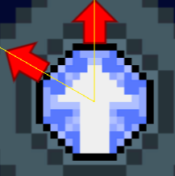
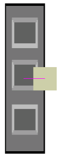
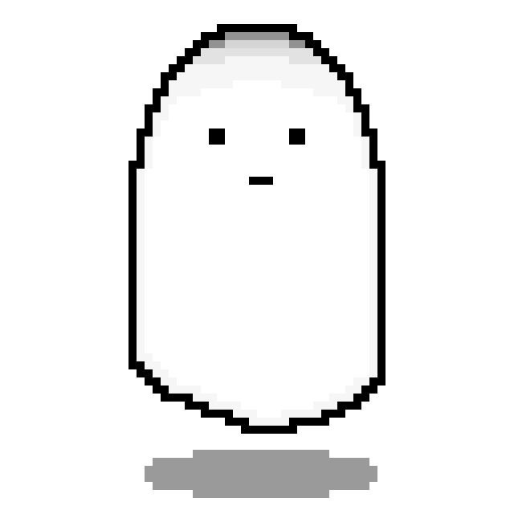

<!--
 * @Copyrights: 2021 @TheJunhan
 * @Date: 2022-01-23 11:44:36
 * @LastEditor: TheJunhan
 * @LastEditTime: 2022-01-23 12:26:18
-->
# 玩法说明
## 操作说明
- 使用上下左右键进行移动
- 按z键与物体进行交互，包括操控/离开机关和拿起/放入宝石
## 道具说明
- 机关：

玩家在附近可以按z进行操作，操作过程中不能移动，可按左右键进行旋转，随着机关的转动，迷宫内物体也的状态也会有所改变，再次按z可以离开机关。
- 巨型镜子：

通过操作机关来转动，可以反射光线。
- 宝石：

根据入射与出射光的相对角度不同，分为不同的种类。可通过白色入射箭头与红色出射箭头来判断宝石的相对折射角度，并且只有在插槽上才能折射光线。玩家同时只能手持一颗宝石。并且宝石不能带到下一关。
- 宝石插槽：

配合宝石对光线进行折射，上面只能同时存在一个宝石。玩家可按z拿取/放入宝石，或者将上面的宝石与手中的进行替换。
- 光感应门：

分为光感应器和门两部分，当光感应器被光照射时门会打开，注意如果一个门上有多个感应器则要都被照射时，门才会打开。

## 敌人

在黑暗中徘徊的幽灵，只能在一定范围内活动，当发现玩家时会加速靠近并杀死玩家，其弱点是会被光线杀死。